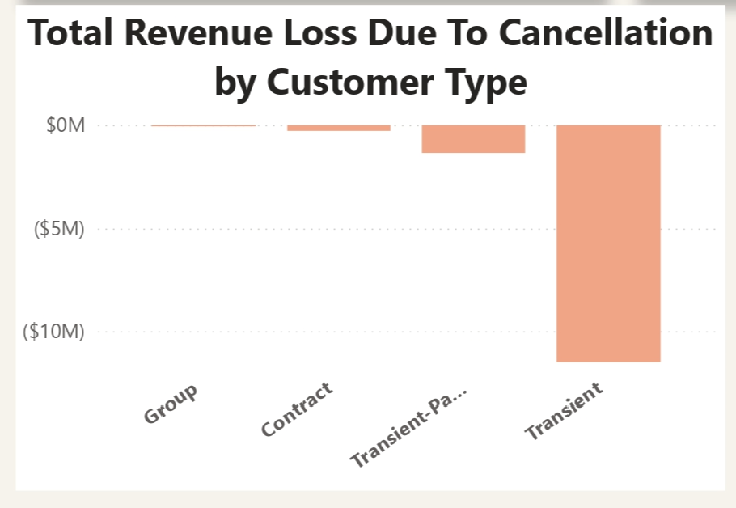

**ENHANCING HOSPITALITY OPERATION: SPLENDOL HOTEL GROUP**

**INTRODUCTION**

Splendor Hotel Groups (SHG) aimed to enhance their services using data insights. As a Data Analyst, my task was to study booking records, uncover trends, and propose ideas for SHG's improvement. We analyzed booking trends, customer behaviors, cancellations, revenue flow, and operational details to optimize SHG's performance. Our investigation spanned various aspects: booking changes over time, guest preferences, and their impact on SHG's operations. Our report 
offers insights and suggestions to boost SHG's efficiency, revenue, and guest experiences. Join us to discover exciting findings in SHG's booking data for smarter decision-making.

**AN OVERVIEW OF THE DATASET**
 

**BUSINESS OBJECTIVES**

**Booking Patterns:**

●	What is the trend in booking patterns over time, and are there specific seasons or months with increased booking activity?

●	How does lead time vary across different booking channels, and is there a correlation between lead time and customer type?

**Customer Behavior Analysis:**

●	Which distribution channels contribute the most to bookings, and how does the average daily rate (ADR) differ across these channels?

●	Can we identify any patterns in the distribution of guests based on their country of origin, and how does this impact revenue?

**Cancellation Analysis:**

●	What factors are most strongly correlated with cancellations, and can we predict potential cancellations based on certain variables?

●	How does the revenue loss from cancellations compare across different customer segments and distribution channels?

**Revenue Optimization:**
●	What is the overall revenue trend, and are there specific customer segments or countries contributing significantly to revenue?

●	Can we identify optimal pricing strategies based on the Average Daily Rate (ADR) for different customer types and distribution channels?

**Geographical Analysis:**

●	How does the distribution of guests vary across different countries, and are there specific countries that should be targeted for marketing efforts?

●	Is there a correlation between the country of origin and the likelihood of cancellations or extended stays?

**Operational Efficiency:**

●	What is the average length of stay for guests, and how does it differ based on booking channels or customer types?

●	Are there patterns in check-out dates that can inform staffing and resource allocation strategies?

**Impact of Deposit Types:**

●	How does the presence or absence of a deposit impact the likelihood of cancellations and revenue generation?

●	Can we identify any patterns in the use of deposit types across different customer segments?

**Analysis of Corporate Bookings:**

●	What is the proportion of corporate bookings, and how does their Average Daily Rate (ADR) compare to other customer types?

●	Are there specific trends or patterns related to corporate bookings that can inform business strategies?

**Time-to-Event Analysis:**

●	How does the time between booking and arrival date (lead time) affect revenue and the likelihood of cancellations?

●	Are there specific lead time ranges that are associated with higher customer satisfaction or revenue?

**Comparison of Online and Offline Travel Agents:**

●	What is the revenue contribution of online travel agents compared to offline travel agents?

●	How do cancellation rates and revenue vary between bookings made through online and offline travel agents?

**DATA COLLECTION AND PROCESSING:**

The data for this project was provided by the CEO of Splendol Hotel Group Mr Uchenna Splendol via Google Drive. The dataset has the following columns:

Booking ID,	Hotel, Booking Date, Arrival Date, Lead Time,	Nights,	Guests,	Distribution Channel (e.g, Direct, Online Travel Agent, Offline Travel Agent), Customer Type(e.g, Transient, Corporate), Country, Deposit Type(e.g, No Deposit, Deposit), Average Daily Rate, Status (e.g, Check-Out, Canceled), Status Update,	Canceled (0/1),	Revenue,	Revenue Loss(negative value if the booking wasn't cancelled).
To gain initial insight into the data, Microsoft Excel was used. The vast functions of Excel and its ease of navigation made it my tool of first choice. To begin with, I simply opened the file in Excel before importing it to Power BI.

**DATA CLEANING AND TRANSFORMATION**

The data came in relatively very clean. After loading into Power BI, checked to make sure the columns were formatted properly. I created measures to calculate averages and sums. The measures are:  Total Revenue, Total Revenue Lost Due To Cancellation, Total Guest, Total Booking, Sum of ADR, Actual Booking, Average ADR, Average Lead Time, Average Length of Stay, Cancelled Booking

**DATA  AND INSIGHT GENERATION**

Now is the time to answer business questions using Power BI query capabilities. I used tools like:

1.Aggregate functions e.g   SUM() and COUNT()
2. Date Function e.g  YEAR() and MONTH
3. FILTER
4. Percentage
5. New measures
6. New columns

**BUSINESS DASHBOARD CREATION**
I finally created the business intelligence dashboard using Power BI, where I made use of the function below: 
1. Shapes
2. Slicers
3. Measures
4. New Columns
5. Color selections
6. Insert Image
7. colorhunt.co

   **THE DASHBOARDS**
   
   
   

**BUSINESS INSIGHT ANALYSIS**

**Booking Patterns:**
What trends exist in booking patterns over time, and are there specific seasons or months with increased booking activity?
Upon analysis, it was noted that hotel bookings peaked in the first quarter of each year, totalling 40,077 bookings, representing 33.5% of the total bookings. January recorded the highest number of bookings, with 16,688, constituting 13.9% of the quarter's total, followed by February with 13,468 bookings, accounting for 11% of the quarter's total and the last quarter of the year closely followed, with 30,862 bookings, representing 25.8%. October stood out in this quarter, registering the highest booking of 12,129, amounting to 10% of the total for that quarter. In the second quarter, she had the lowest bookings, totalling 22,538, representing 18.9%, with June recording the least bookings for the quarter.

**Lead Time Analysis across Different Booking Channels:**
How does lead time vary across different booking channels, and is there a correlation between lead time and customer type?
Among the various booking channels, the offline travel agent had the highest average lead time of 136.6, accounting for 36.7%, followed by the online travel agent  with an average lead time of 108, representing 29.3%. The direct booking channel showed an average lead time of 57.9, making up 15.6%. Corporate booking channel exhibited the shortest average time of 45, constituting 12% of the entire lead time.

**Customer Behavior Analysis:**
Which distribution channels contribute the most to bookings, and how does the average daily rate (ADR) differ across these channels?
The online travel agent contributed the most to bookings, with a total of 74,072, representing 62% of the entire bookings.

**Impact of Guest Country of Origin on Revenue:**
Can we identify any patterns in the distribution of guests based on their country of origin, and how does this impact revenue?
The majority of guests were Portuguese, totalling 90,000 and representing 53% of all visitors. Subsequently, guests from the United Kingdom totalled 24,568, accounting for 14.6%. Other countries with significant visitor numbers were France (21,579, 13%), Spain (18,153, 10.7%), and Germany (14,189, 8.4%). 
The revenue trend indicates that higher successful bookings from specific customer segments or countries result in increased revenue from those sources. Notably, Portugal, with the most guests, contributed $9 million, representing 44% of the entire revenue. Following this, the United Kingdom contributed $4.2 million, constituting 20% of the revenue.This has been earlier supported by the a chart.

**Cancellation Analysis:**
What factors strongly correlate with cancellations, and can we predict potential cancellations based on certain variables?
It was found that bookings made with no deposit had the highest cancellation rate of 67%, followed by those under the non-refundable deposit type with a cancellation rate of 33%. Among booking channels, online travel agents exhibited 
the highest cancellation rate of 72%, while offline travel agents had a 19% cancellation rate. In terms of customer type, transient customers had the highest cancellation rate of 83%, followed by transient-party customers at 14.5%.
remain1

**Comparison of Revenue Loss from Cancellations:**
How does the revenue loss from cancellations compare across different customer segments and distribution channels?
The revenue loss due to cancellation was highest among transient customers, valued at $12 million, representing 88% of the total loss, averaging $2.4 million annually. Following this, online travel agents experienced a total revenue loss of $11 million, representing 82% of the total loss, averaging $2.2 million per annum.

**Operational Efficiency:**
The average guest stay duration is three days. Contract customers have the longest average stay, averaging five days, significantly differing from other customer types. Additionally, check-out dates peak in the third quarter of the year, with August having the highest check-out frequency.

**Analysis of Corporate Bookings:**
Corporate bookings accounted for 6% of the total bookings, totalling 6,677. The Average Daily Rate (ADR) from corporate bookings ranked as the fourth highest, standing at 17%. Corporate bookings were most prevalent in January, October, February, and September, respectively.

**Time-to-Event Analysis:**
In analyzing lead time (ranging from 0 to 737), I segmented it into four equal parts: Short Time, Mid Time, Long Time, and Extended Time, corresponding to multiples of 1, 2, 3, and 4, respectively. The Short Time segment generated the highest revenue, totalling $24 million, representing 80% of the total revenue. Conversely, the Extended segment generated the least revenue. This illustrates that lead time significantly impacts revenue, with longer lead times resulting in lower revenue. Moreover, the cancellation rate is higher among extended customers, accounting for 39% of total cancellations, whereas the Short-Time segment exhibited the lowest cancellation rate at 13%.

**Comparison of Online and Offline Travel Agents:**
Online bookings displayed a higher cancellation rate at 21% compared to offline bookings, which stood at 17%. Despite this, online travel agents contributed more revenue, totalling $18 million, constituting 58% of the generated revenue. In contrast, offline travel agents generated $7 million, accounting for 24% of the total revenue.

**Findings/ Insight**
Based on the comprehensive analysis conducted, several key findings emerged:

1.	**Booking Patterns:**
•	Peak booking periods were observed in the first and last quarters, with January and October standing out as high-booking months.
•	June experienced the lowest bookings among the quarters.

2.	**Lead Time Analysis across Booking Channels:**
•	Offline travel agents and corporate bookings showed longer lead times compared to direct and online channels.

3. **Customer Behavior Analysis:**
•	Online travel agents contributed significantly to bookings, making up 62% of total bookings.

4.	**Impact of Guest Country on Revenue**
•	Majority of guests were Portuguese, followed by visitors from the United Kingdom, France, Spain, and Germany.

5.	**Cancellation Analysis:**
•	Bookings made with no deposits had the highest cancellation rate at 67%, with online travel agents showing the highest cancellation rate among channels (72%).

6.	**Comparison of Revenue Loss from Cancellations:**
•	Transient customers experienced the highest revenue loss due to cancellations, followed by online travel agents.

7.	**Revenue Optimization:**
•	Portugal contributed the most to revenue, followed by the United Kingdom.

8.	**Operational Efficiency:**
•	The average guest stay duration is three days, with contract customers having the longest stay (five days).
•	Peak check-out dates were observed in August, during the third quarter.

9.	**Analysis of Corporate Bookings:**
•	Corporate bookings represented 6% of total bookings, with a higher Average Daily Rate (ADR).

10.  **Time-to-Event Analysis:**
•	Shorter lead times resulted in higher revenue, while extended lead times generated lower revenue and higher cancellation rates.

11.	**Comparison of Online and Offline Travel Agents:**
•	Despite a higher cancellation rate, online travel agents contributed significantly more to revenue compared to offline agents.
These findings provide valuable insights into booking trends, revenue generation, and operational aspects, aiding in informed decision-making and strategies for Splendor Hotel Group's hospitality operations.

**RECOMMENDATION**
Based on the comprehensive analysis and findings derived from the booking data, several strategic recommendations can be proposed to optimize operations and enhance revenue for Splendor Hotel Groups:
1.	**Adjust Marketing Strategies based on Booking Patterns:**
•	Capitalize on the peak booking periods in January and October by launching targeted marketing campaigns or promotional offers to attract more guests during these months.
•	Implement strategies to boost bookings during the low-booking period in June, such as offering special packages or events.
2.	**Tailored Approach for Different Booking Channels:**
•	Focus on streamlining processes for offline travel agents and corporate bookings to reduce lead times and enhance efficiency.
•	Invest in online travel agent partnerships to maintain their significant contribution to bookings and revenue.
3.	**Geographically Targeted Marketing:**
•	Leverage the dominance of Portuguese guests by tailoring marketing efforts or loyalty programs to attract more visitors from this region.
•	Consider similar strategies for other significant visitor countries like the United Kingdom, France, Spain, and Germany to further diversify guest demographics.
4.	**Deposit Policies and Customer Type Management:**
•	Review deposit policies to reduce cancellation rates, especially for bookings made without deposits.
•	Implement customer-specific strategies, such as tailored promotions or guarantees, to minimize cancellation rates for transient customers.
5.	**Revenue Maximization Strategies:**
•	Further develop services or incentives targeting Portuguese guests to maintain their significant contribution to revenue.
•	Explore initiatives to increase revenue from the United Kingdom market through personalized offerings or loyalty programs.
6.	**Operational Efficiency Enhancement:**
•	Evaluate opportunities to optimize operations during peak check-out dates in August, potentially by staffing adjustments or targeted resource allocation.
7.	**Corporate Booking Management:**
•	Focus on nurturing corporate partnerships by offering additional perks or services to enhance the overall experience for corporate guests.
8.	**Lead Time Optimization and Risk Mitigation:**
•	Encourage shorter lead times by offering incentives or discounts for immediate bookings to minimize revenue loss associated with longer lead times and cancellations.
•	Implement strategies to mitigate risks associated with extended lead times, such as flexible cancellation policies or proactive communication to secure bookings.
9.	**Online vs. Offline Travel Agent Strategies:**
•	Despite the higher cancellation rate, consider further collaboration and partnerships with online travel agents to leverage their significant revenue contribution.
•	Explore ways to improve the booking experience for offline travel agents to potentially decrease cancellations while maintaining revenue.

These recommendations, based on the in-depth analysis of the booking data, aim to capitalize on strengths, address weaknesses, and strategically position Splendor Hotel Groups to enhance guest experiences, operational efficiency, and revenue streams. Adjustments and implementations based on these suggestions may lead to improved performance and sustained growth in the competitive hospitality industry.

